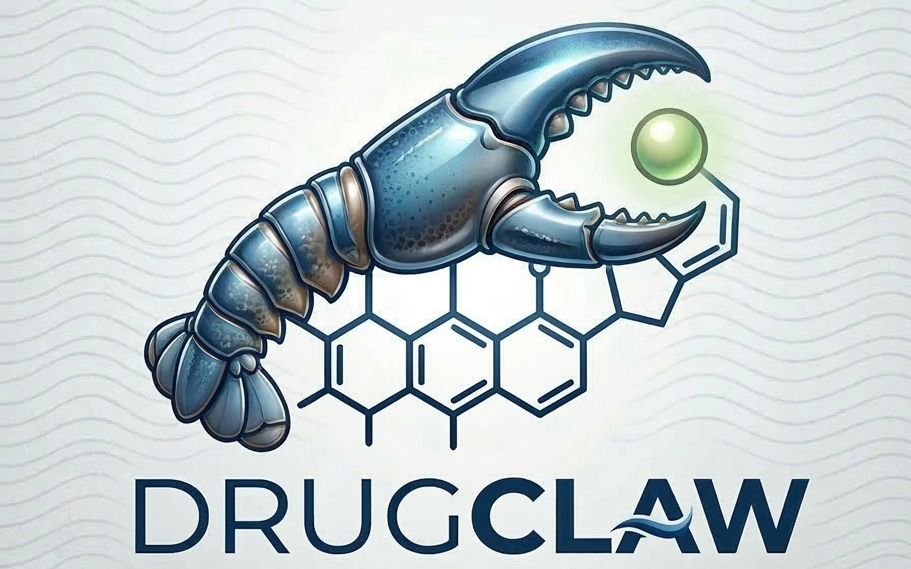
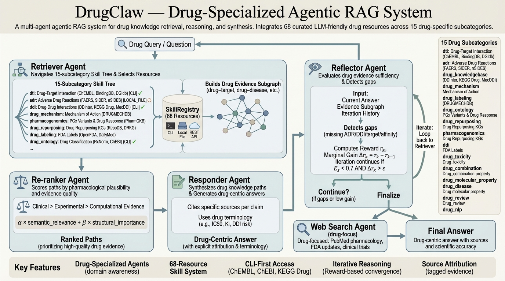

# DrugClaw

<p align="center">
  
</p>

<p align="center">
  <strong>面向药物知识检索、推理与证据综合的 Agentic RAG 系统</strong>
</p>

<p align="center">
  <a href="./README.md">English Version</a>
</p>

<p align="center">
  
  
  
  
</p>

DrugClaw 是一个围绕药物任务构建的多智能体 RAG 系统，专门处理通用助手经常答不深、答不稳的问题，例如药物靶点、药物不良反应、药物相互作用、作用机制、药物基因组学、药物重定位，以及跨异构生物医学资源的证据综合。

它不是“通用 RAG 套一层生物医学提示词”，而是从资源组织、检索策略、推理链路到回答形式，都明确面向 drug-native 场景设计。

## 为什么是 DrugClaw

大多数生物医学问答系统停留在“检索几段文本然后总结”的层面，但药物问题真正难的地方，往往在于能不能把靶点证据、ADR 来源、DDI 机制、标签信息和 PGx 约束这些细节讲清楚。也有一些工具虽然接入了很多数据库，却把所有资源强行压成同一种接口，最后牺牲了资源本身的表达力；还有一些系统更强调对话体验或代理外壳，但底层缺少足够密集、结构化且可追溯的药物资源支撑，最终还是回到“语言流畅但证据偏薄”。

- 通过 **注册表驱动的 15 类技能树**组织药物资源
- 通过 **Code Agent** 为不同资源现写查询代码，而不是强行塞进单一死板接口
- 支持 **图结构推理**，更适合多跳药物证据综合
- 保留 **Web Search** 作为最新文献和外部证据的补充通道
- 从设计上就面向 **药物原生任务**，而不是泛化的 biomedical branding

运行时资源注册表是资源数量、启用状态和可用性说明的唯一真相源。实际可用性取决于当前环境、本地 `resources_metadata/` 文件、可选依赖以及 API 可达性。

换句话说，DrugClaw 的优势不是“再做一个会说话的助手”，而是尽量把药物资源的密度、检索的真实性和证据综合能力同时拉起来。它更适合回答那些需要跨多个资源交叉验证、需要说明证据来自哪里、以及需要把检索结果进一步组织成推理链的问题。

## 快速开始

以下命令默认都在你刚 clone 下来的仓库根目录执行。

### 1. 创建 `.venv` 并安装依赖

```bash
python3 -m venv .venv
. .venv/bin/activate  # Windows: `.venv\\Scripts\\activate`
python -m pip install --upgrade pip
python -m pip install -e .[dev] --no-build-isolation
```

可选依赖，仅在你要启用对应 CLI 型 skill 时安装：

```bash
python -m pip install chembl_webresource_client
python -m pip install libchebipy
python -m pip install bioservices
```

### 2. 准备 `navigator_api_keys.json`

DrugClaw 使用任何 **OpenAI 兼容** 的 API 端点，包括 OpenAI、Azure OpenAI、通过 vLLM 或 Ollama 提供的 LLaMA，以及其他 OpenAI 兼容的服务商。

先复制模板文件：

```bash
cp navigator_api_keys.example.json navigator_api_keys.json
```

然后填写你自己的真实凭证：

```json
{
  "api_key": "your-api-key-here",
  "base_url": "https://your-endpoint.com/v1",
  "model": "gpt-4o",
  "max_tokens": 20000,
  "timeout": 60,
  "temperature": 0.7
}
```

**常见服务商配置示例：**

| 服务商 | `base_url` | `model` |
| --- | --- | --- |
| OpenAI | `https://api.openai.com/v1` | `gpt-4o`, `gpt-4o-mini` |
| vLLM (本地 LLaMA) | `http://localhost:8000/v1` | `meta-llama/Llama-3.1-8B-Instruct` |
| Ollama | `http://localhost:11434/v1` | `llama3.1`, `qwen2.5` |
| Together AI | `https://api.together.xyz/v1` | `meta-llama/Llama-3.1-70B-Instruct-Turbo` |

如果你必须继续使用其他文件名，例如 `api_keys.json`，请显式传入 `--key-file api_keys.json`。

### 3. 直接运行官方 CLI Demo

这是当前最推荐的体验入口。到这一步你只需要把 LLM 配好；本地资源包可以后面再补。

无需安装也可以直接用模块方式运行：

```bash
python -m drugclaw list
python -m drugclaw doctor
python -m drugclaw demo
```

默认会固定使用：

- `SIMPLE` 模式
- 在线标签类资源
- 默认 metformin 说明书与安全信息查询

你也可以手动运行自定义问题：

```bash
python -m drugclaw run --query "What are the known drug targets of imatinib?"
```

如果你想在排查时看到规划结果、claim 摘要或 agent 日志，可以直接打开这些开关：

```bash
python -m drugclaw run --query "What does imatinib target?" --show-plan --show-claims
python -m drugclaw run --query "What prescribing and safety information is available for metformin?" --debug-agents
```

如果你想把自己的问题额外保存成一份本地可视化报告，可以显式传入：

```bash
python -m drugclaw run --query "What does imatinib target?" --save-html-report
```

执行后会在 `query_logs/<query_id>/report.html` 生成单文件 HTML 报告，并在命令结束时打印保存路径。

如果这里已经能跑通，你其实已经有了一条最小可用路径。下一步是增强项，主要用于提升覆盖面，并启用依赖本地数据的那些 skill。

### 4. 准备本地资源目录 `resources_metadata/` 以获得更广覆盖

不少 skill 的访问模式是 `LOCAL_FILE`。这类资源不是首次 demo 的硬前置条件，但会影响覆盖面，也决定了部分本地数据型 skill 能不能真正可用。

推荐的数据解析顺序：

- 先用当前仓库里已经存在的 `resources_metadata/...`
- 如果本地缺失，优先从维护好的镜像仓库同步
- 只有镜像也没有时，再回到原始官网或数据下载页手动获取
- 不要把私有凭证、本地快照或临时下载文件提交到 `resources_metadata/`；版本库里只保留测试所需的最小 fixture

当前维护的镜像仓库：

- `https://huggingface.co/datasets/Mike2481/DrugClaw_resources_data`

目录约定示例：

- `resources_metadata/dti/...`
- `resources_metadata/adr/...`
- `resources_metadata/drug_knowledgebase/...`
- `resources_metadata/drug_repurposing/...`
- `resources_metadata/ddi/...`

如果某些旧的 `SKILL.md`、`example.py` 或历史文档里还保留绝对路径，只把它们当作示例；实际应以当前仓库下的 `resources_metadata/...` 为准。

如果你想让更多 dataset/local-file 资源真正可用，或者希望检索更稳定、更全，再做这一步最合适。

### 5. 直接使用已安装的 `drugclaw` 命令

```bash
git config core.hooksPath .githooks
drugclaw list
drugclaw doctor
drugclaw demo
drugclaw run --query "What are the known drug targets of imatinib?"
```

### 6. 可选示例与兼容入口

官方入口仍然是 CLI；如果你想看示例脚本或兼容包装器，现在统一放在 `examples/`。

轻量 demo 包装脚本现在是：

```bash
python examples/run_minimal.py
```

也可以把参数原样透传给 CLI：

```bash
python examples/run_minimal.py demo --preset label
python examples/run_minimal.py run --query "What prescribing and safety information is available for metformin?"
```

### 7. 需要排查问题时再做环境自检

```bash
python -m drugclaw doctor
```

它会检查：

- `navigator_api_keys.json` 是否存在且字段完整
- `langgraph` 和 `openai` 是否可导入
- 内置 demo 依赖的资源当前是否具备运行条件
- 是否已经安装出 `drugclaw` 命令
- `navigator_api_keys.json` 是否仍被 Git 跟踪
- 是否已启用仓库自带的 Git hooks

### 8. 启用防泄露 Git hooks

```bash
git config core.hooksPath .githooks
```

启用后会阻止：

- 提交 API 密钥文件

### 9. 查看内置 demo 和推荐入口

```bash
python -m drugclaw list
```

它会列出：

- 内置 demo 预设
- 三种思考模式
- 推荐的首条体验命令
- 常用资源组合

### 10. 如果你想自己写调用代码

```python
from drugclaw.config import Config
from drugclaw.main_system import DrugClawSystem
from drugclaw.models import ThinkingMode

config = Config(key_file="navigator_api_keys.json")
system = DrugClawSystem(config)

result = system.query(
    "What prescribing and safety information is available for metformin?",
    thinking_mode=ThinkingMode.SIMPLE,
    resource_filter=["DailyMed", "openFDA Human Drug", "MedlinePlus Drug Info"],
)

print(result["answer"])
```

### 11. 三种思考模式

```python
from drugclaw.models import ThinkingMode

system.query("...", thinking_mode=ThinkingMode.GRAPH)
system.query("...", thinking_mode=ThinkingMode.SIMPLE)
system.query("...", thinking_mode=ThinkingMode.WEB_ONLY)
```

## 核心亮点

<p align="center">
  
</p>

### 1. Vibe-Coding 检索

每个 skill 都带有自己的 `SKILL.md` 和 `example.py`。Code Agent 会读取这两份材料，理解资源原生调用方式，自动生成针对当前问题的查询代码并执行。

这意味着 DrugClaw 不需要强迫所有数据库、API、数据集都长成同一种接口。

对于 `LOCAL_FILE` 类型的 skill，推荐的默认行为是：

- 先检查当前仓库的 `resources_metadata/...`
- 若缺失，再提示使用 Hugging Face 镜像仓库补齐
- 不要默认假设原始下载链接仍然可用

### 2. 明确围绕药物任务组织

当前通过运行时资源注册表覆盖全部 15 个子类别：

- 药物靶点与活性（DTI）
- 不良反应与药物警戒（ADR）
- 药物知识库
- 药物机制
- 药品标签与说明书
- 药物本体与标准化
- 药物重定位
- 药物基因组学
- 药物相互作用
- 药物毒性
- 药物组合
- 药物分子性质
- 药物-疾病关联
- 患者评价
- 药物 NLP / 文本挖掘

### 3. 三种工作模式

- `GRAPH`：检索 -> 建图 -> 重排 -> 作答 -> 反思
- `SIMPLE`：检索后直接作答
- `WEB_ONLY`：只走在线检索和文献搜索

### 4. 适合证据综合型问题

DrugClaw 适合回答的问题包括：

- “伊马替尼已知的靶点、不良反应和相互作用风险有哪些？”
- “哪些已批准药物可能重定位到三阴性乳腺癌？”
- “氯吡格雷与 CYP2C19 有哪些药物基因组学建议？”
- “华法林与 NSAIDs 之间是否存在临床上重要的相互作用？”

## 架构

```text
用户问题
   |
   v
Retriever Agent
   |- 浏览 15 类技能树
   |- 抽取关键实体
   |- 选择合适资源
   |
   v
Code Agent
   |- 读取 SKILL.md + example.py
   |- 生成定制查询代码
   |- 执行资源特定检索
   |
   +--> SIMPLE 模式 --> Responder --> 最终回答
   |
   +--> GRAPH 模式
         -> Graph Builder
         -> Reranker
         -> Responder
         -> Reflector
         -> 可选 Web Search
         -> 最终回答
```

## 注册表检查

可以通过 CLI 查看当前注册表摘要和逐资源状态：

```bash
python -m drugclaw list
python -m drugclaw doctor
```

`list` 会显示基于注册表生成的总数和每个资源的状态。`doctor` 会解释资源为什么不可用，例如缺少本地 metadata 或缺少依赖。

如果你想在可读回答之外同时看到结构化 claim / evidence 摘要，可以这样运行：

```bash
python -m drugclaw run --query "What does imatinib target?" --show-evidence
```

## 已实现技能

| 类别 | 技能 |
| --- | --- |
| DTI | ChEMBL, BindingDB, DGIdb, Open Targets Platform, TTD, STITCH, TarKG, GDKD, Molecular Targets, Molecular Targets Data |
| ADR | FAERS, SIDER, nSIDES, ADReCS |
| 药物知识库 | UniD3, DrugBank, IUPHAR/BPS, DrugCentral, CPIC, PharmKG, WHO Essential Medicines List, FDA Orange Book |
| 药物机制 | DRUGMECHDB |
| 药品标签 | openFDA Human Drug, DailyMed, MedlinePlus Drug Info |
| 药物本体 | RxNorm, ChEBI, ATC/DDD, NDF-RT |
| 药物重定位 | RepoDB, DRKG, OREGANO, Drug Repurposing Hub, DrugRepoBank, RepurposeDrugs |
| 药物基因组学 | PharmGKB |
| DDI | MecDDI, DDInter, KEGG Drug |
| 药物毒性 | UniTox, LiverTox, DILIrank, DILI |
| 药物组合 | DrugCombDB, DrugComb |
| 药物分子性质 | GDSC |
| 药物-疾病 | SemaTyP |
| 患者评价 (2) | WebMD Drug Reviews, Drug Reviews (Drugs.com) |
| 药物 NLP (7) | DDI Corpus 2013, DrugProt, ADE Corpus, CADEC, PsyTAR, TAC 2017 ADR, PHEE |

另有 `WebSearch` 作为 DuckDuckGo + PubMed 风格的外部检索补充。

## 仓库结构

```text
README.md / README_CN.md
  面向 GitHub 新用户的入口文档

examples/
  可选运行示例与兼容包装脚本

scripts/legacy/
  历史维护脚本，不属于公开接口

drugclaw/
  运行时包与 CLI 主入口

skills/
  <subcategory>/<skill_name>/
    *_skill.py
    example.py
    SKILL.md
    README.md

skillexamples/
  面向单个资源的示例与操作说明

tools/
  维护者使用的 smoke check 与资源校验脚本

resources_metadata/
  本地数据文件
```

如果你想看更面向贡献者的目录说明，可以继续读 `docs/repository-guide.md`。

## 差异化优势

### 资源原生查询，而不是强制统一抽象

DrugClaw 不要求每个生物医学资源都伪装成同一种数据库接口。

### 图结构推理，而不是平铺式总结

DrugClaw 可以把自由文本检索结果进一步转成三元组、子图、路径排序和基于证据的回答，而不是简单摘抄后拼接。

### 药物优先，而不是泛生物医学包装

这个系统明确围绕药物任务构建：DTI、ADR、DDI、标签、重定位、PGx 与机制推理，而不是一个泛化的 biomedical assistant。

## 当前说明

- 当前仓库在项目根目录下可直接导入运行。
- `pyproject.toml` 已与当前目录结构对齐，便于本地 CLI 安装。
- 部分 skill 依赖 `resources_metadata/` 下的本地数据文件。
- 默认 `GRAPH` 模式的多轮迭代能力还依赖进一步配置，例如 `MAX_ITERATIONS`。

## 引用

如果你在科研或产品中使用 DrugClaw，请同时引用本仓库以及对应 skill 所使用的原始上游数据资源。

## 许可证

MIT License
